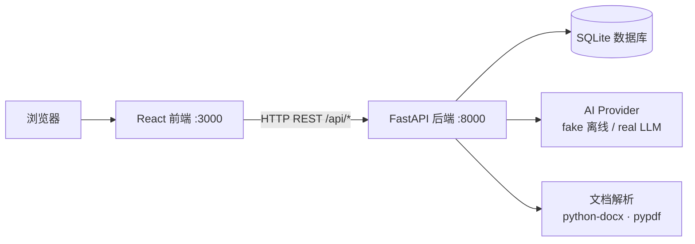

# 招聘 AI 助手 · 面试使用说明

> 给面试官的一份独立使用指南。开发者视角的完整说明见仓库内 `README.md`；作品集三件套（可运行 / 代码 / 预览）见 `作品集交付说明.md`。

---

## 一、这是什么（30 秒看懂）

**智能招聘 AI 助手**是一个**可真实运行**的全栈 AI 应用 Demo：

> HR 上传一份简历 → AI 自动抽取姓名 / 岗位 / 技能等结构化字段并预填 → HR 核对确认后入库 → 候选人进入流程状态流转（筛选 → 面试 → Offer）→ AI 运营助手基于全量台账自动生成「今日待办 + 运营洞察 + 企业微信简报」。

**三大亮点（建议面试开场先讲这三句）：**

1. **全栈闭环**：React 前端 + FastAPI 后端 + SQLite，数据真实落库，不是前端 mock 假数据。
2. **真实文档解析**：后端用 python-docx / pypdf **真实抽取** DOCX / PDF 文本，绕开了「前端读二进制乱码」的坑。
3. **离线也能演示**：内置 fake AI 模式，**无需任何 API Key** 即可完整跑通；需要时一键切真实大模型。

---

## 二、三种打开方式（任选其一）

### 方式 A · 在线预览（最省事，推荐给面试官）

- 链接：`<把 frontend/dist 拖到 Netlify Drop 后得到的公网地址，例如 https://xxxx.netlify.app>`
- 这是纯前端「演示模式」，内置示例候选人 / 解析结果 / AI 大盘数据，**完全不依赖后端**，打开即用、刷新不丢。
- 部署方法（30 秒，无需 GitHub、无需命令行）：项目里**已为你构建好最新的 `frontend/dist`**（demo 模式），直接把该文件夹**整个拖到** https://app.netlify.com/drop 即可拿到公网链接。（仓库已内置 `netlify.toml` 与 `_redirects`，刷新不会 404；也可用 Vercel 导入仓库，Output 目录填 `frontend/dist`。）

### 方式 B · 一键本地运行（完整前后端 + 真实数据库）

适用系统：**macOS**。

1. 双击项目根目录的 **`启动完整招聘AI-Demo.command`**。
2. 脚本自动完成：建 Python 虚拟环境 → 装依赖 → 启动后端 `http://localhost:8000` → 启动前端 `http://localhost:3000` → 自动打开浏览器。
3. 关闭启动窗口即同时停止前后端。

- 前提：本机已装 Python 3.12+ 与 Node.js（脚本会自检，缺失会提示去装）。

### 方式 C · 源码运行（开发者）

**后端**（终端执行）：

```bash
cd recruitment-ai-demo
python3 -m venv .venv
source .venv/bin/activate
pip install -e .
export AI_MODE=fake            # 离线演示模式，无需任何 API Key
uvicorn src.api.main:app --reload --port 8000
```

**前端**（另开一个终端）：

```bash
cd recruitment-ai-demo/frontend
npm install --registry=https://registry.npmmirror.com   # 国内镜像，装得快
npm run dev
```

浏览器打开 `http://localhost:3000`。

> 提示：若 `npm install` 很慢，务必加 `--registry=https://registry.npmmirror.com` 走国内镜像。

---

## 三、5 分钟演示路线（面试官能点的功能）

| 步骤 | 页面 | 操作 | 预期效果 |
|---|---|---|---|
| 1 | 简历智能录入 | 粘贴文本或上传一份 DOCX/PDF，点「开始 AI 智能提取」 | 自动抽字段、预填表单；可展开看「字段证据 / 置信度」 |
| 2 | 简历智能录入 | 核对微调后点「确认入库」 | 候选人写入 SQLite，自动进入流程页 |
| 3 | 候选人全流程 | 按岗位 / 部门 / 状态筛选、关键词搜索；点某行看详情 | 看到完整档案 + 历次面试记录 |
| 4 | 候选人全流程 | 改状态（通过 / 拒绝 / 面试中）、追加一轮面试 | 状态与面试记录实时落库，不覆盖历史 |
| 5 | AI 招聘运营助手 | 切到看板页 | 自动生成今日待办、运营洞察、一键企业微信简报 |

> **演示建议**：先用方式 A 在线预览快速过一遍 UI；若面试官想看「真实数据落库」，再用方式 B 双击脚本跑全栈版，现场改一条状态、刷新页面即见效果。

---

## 四、技术架构



- **前端**：React 18 + TypeScript + Tailwind CSS + Vite（企业级招聘 SaaS 深色工作台）
- **后端**：Python + FastAPI + SQLModel（ORM）+ SQLite
- **AI**：Provider 抽象层，`AI_MODE=fake` 离线确定性解析 / `AI_MODE=real` 接真实 LLM
- **文档解析**：python-docx / pypdf 真实抽取 DOCX / PDF 文本

---

## 五、项目结构与代码链接

```text
recruitment-ai-demo/
├── frontend/                 # React 前端（Vite + Tailwind）
│   ├── src/components/       # 简历录入 / 候选人流程 / AI 运营助手
│   └── dist/                 # 构建产物（部署用）
├── src/
│   ├── api/                  # FastAPI 接口层（main.py / service.py / schemas.py）
│   ├── ai/                   # AI Provider 抽象（fake / real）
│   ├── db/                   # SQLite 仓储
│   └── documents/            # 文档解析
├── data/                     # SQLite 数据库（自动创建）
├── samples/                  # 匿名简历样本
├── 启动完整招聘AI-Demo.command  # 一键启动（macOS）
└── README.md
```

- **代码链接**：`https://github.com/BLUEasddaaaaaaa/recruitment-ai-demo`（把 `recruitment-ai-demo` 换成你在 GitHub 新建仓库时实际用的名字）
  - 生成方式见仓库内 `作品集交付说明.md` 的「代码链接」一节（需你在本机执行一次 `git push`）。

---

## 六、亮点深挖（面试谈资）

1. **文档解析踩坑与解决**：前端最初用 `readAsText` 读 DOCX/PDF，结果二进制 ZIP 被当文本读出一堆乱码。改法：二进制文件改用 `readAsDataURL` 取 base64 上传，后端用 python-docx / pypdf **真实抽取**，返回 `extractedText`——既正确又保留原始格式证据。
2. **演示 / 真实双模式**：`AI_MODE` 切换 fake / real；前端另有 `VITE_DEMO_MODE=1` 演示模式，纯前端内置数据，**断网、无后端也能完整展示 UI 与交互**，专门解决「面试官点开就要能看到」的诉求。
3. **工程完整度**：前后端分离、REST 接口清晰、CORS 已开、一键脚本自动建环境、演示模式可静态托管——体现从「能跑」到「能交付」的全栈能力。
4. **安全边界**：仅允许受控、匿名化演示输入，不存储简历原文件，附件只留安全元数据与哈希引用。

---

## 七、运行模式

- 默认 `AI_MODE=fake`：本地确定性解析，全程离线，无需密钥（演示推荐）。
- 真实 AI（可选）：

```bash
export AI_MODE=real
export OPENAI_API_KEY='你的key'
export OPENAI_MODEL='你的模型'
```

---

## 八、常见问题 / 排错

- **前端打不开 / 白屏？** 先确认后端 `http://localhost:8000/api/health` 返回 `{"status":"ok"}`；若只想看 UI 不连后端，用方式 A 的演示模式（或构建时设 `VITE_DEMO_MODE=1`）。
- **3000 / 8000 端口被占用？** 改端口：后端 `uvicorn ... --port 8080`；前端在 `frontend/.env` 设 `VITE_API_BASE_URL=http://localhost:8080`。
- **`npm install` 卡住？** 加国内镜像：`npm install --registry=https://registry.npmmirror.com`。
- **双击 `.command` 提示「未找到 node/npm」？** 安装 Node.js（https://nodejs.org）后重开终端再双击；脚本已内置 WorkBuddy 托管运行时兜底。
- **数据在哪？** 全栈模式数据落在 `data/recruitment.db`（SQLite），删除该文件即重置演示数据。
